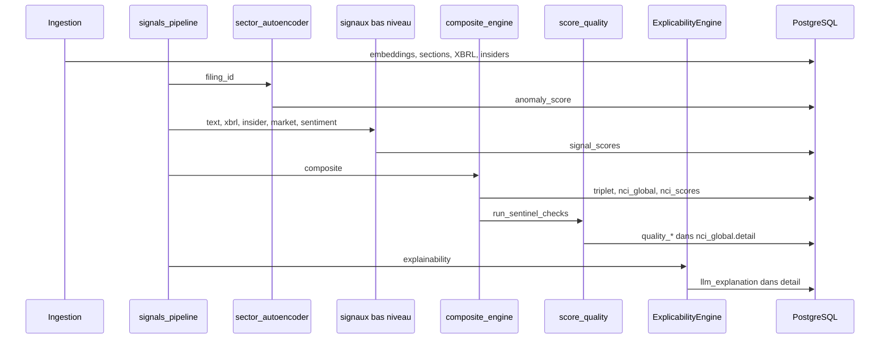

# FinPulse — Responsabilités & fonctionnement détaillé

> Document de référence (PI3) : Sector Autoencoder, Convergence triplet, Explicabilité, Sentinel / Score Quality.  
> Dernière mise à jour : corrections pipeline unifiée + persistance qualité NCI.

---

## 1. Vue d’ensemble du projet

**FinPulse** ingère des filings SEC (10-K / 10-Q), produit des **embeddings** de paragraphes, calcule des **signaux** (texte, XBRL, insiders, marché, sentiment), agrège un score composite **NCI** (Narrative Convergence Index), contrôle sa **qualité** (Sentinel), et peut générer une **explication** en langage naturel.

### Couches logicielles

| Couche | Rôle | Dossiers clés |
|--------|------|----------------|
| Ingestion | Téléchargement EDGAR, sections, embeddings | `ingestion/`, `pipelines/` (ingestion) |
| Signaux | Métriques par filing | `signals/` |
| Composite | NCI + convergence | `signals/composite_engine.py` |
| API | REST FastAPI | `app/api/v1/` |
| Pipeline signaux | Orchestration bout-en-bout | `pipelines/signals_pipeline.py` |

### Pipeline signaux unique (`run_all_signals`)

Point d’entrée : `pipelines/signals_pipeline.py` → `run_all_signals(filing_id)`.

```
┌─────────────────────────────────────────────────────────────────────────┐
│  PRÉREQUIS : embeddings déjà en base (pipeline ingestion / Mistral)      │
└─────────────────────────────────────────────────────────────────────────┘
                                    │
                                    ▼
  1. autoencoder      → anomaly_score sur chaque embedding (secteur SIC)
  2. text             → RLDS, MD&A drift, forward_pessimism, …
  3. xbrl             → détérioration fondamentale, stress bilan, …
  4. insider          → ITA, insider_signal (behavior)
  5. market           → market_signal
  6. sentiment        → sentiment_signal
  7. composite        → divergence, convergence multi-couches, triplet, NCI, Sentinel
  8. explainability   → LLM (Spring AI ou Mistral) → stocké dans nci_global.detail
                                    │
                                    ▼
              filing.processing_status = "signal_scored"
```

**Lancer la pipeline :**

```bash
python -m pipelines.signals_pipeline --filing-id <ID>
```

**Comportement des erreurs :**

| Stage | Échec |
|-------|--------|
| `autoencoder` | **Soft-fail** — pipeline continue |
| `text` … `composite` | **Hard-fail** — filing en `failed` |
| `explainability` | **Soft-fail** — pipeline continue |

---

## 2. Responsabilité 1 — Sector Autoencoder

### Objectif

Détecter les paragraphes dont le **langage sémantique** s’écarte des habitudes du **secteur** (code SIC), via un autoencodeur entraîné par secteur.

### Fichiers

| Fichier | Rôle |
|---------|------|
| `signals/sector_autoencoder.py` | Architecture 1024→512→256→512→1024, scoring, validation batch |
| `train_autoencoder.py` | Entraînement par secteur |
| `score_embeddings.py` | CLI scoring manuel |
| `pipelines/signals_pipeline.py` | Stage `_run_autoencoder_stage` |
| `app/api/v1/endpoints/embeddings.py` | `GET /embeddings/{ticker}/anomalies` |

### Ce qui se passe, étape par étape

1. **Chargement** de tous les `Embedding` du `filing_id`.
2. **`validate_embedding_batch`** : rejette NaN, Inf, vecteurs nuls ; si &lt; 50 % valides → scoring annulé.
3. **Modèle secteur** : `SectorAutoencoderManager.load_model(sic_code)` charge poids + **seuil** (95e percentile MSE du secteur).
4. Pour chaque embedding valide :
   - Passage dans l’autoencodeur → reconstruction.
   - **MSE** = erreur de reconstruction.
   - **`anomaly_score`** = `min(1.0, mse / seuil_secteur)` ∈ [0, 1].
5. **Persistance** : `embedding.reconstruction_error`, `embedding.anomaly_score` ; `commit=True` en pipeline.
6. Retour de `SuspectParagraph` (top suspects) pour usages aval (ex. RLDS / explicabilité).

### Seuil sectoriel

Le seuil est le **95e percentile** des MSE observés à l’entraînement pour le secteur. Un paragraphe avec MSE ≈ seuil → `anomaly_score` ≈ 1.

### API anomalies

`GET /api/v1/embeddings/{ticker}/anomalies?filing_id=&top_k=5`

Retourne : `text`, `section`, `anomaly_score`, `mse`, `sector_threshold`.

### État après correctifs

- ✅ `commit=True` en pipeline  
- ✅ `validate_embedding_batch()` avant scoring  
- ✅ Endpoint anomalies  
- ⚠️ Nécessite modèle entraîné par SIC + embeddings en base  

---

## 3. Responsabilité 2 — Signal de convergence triplet

### Objectif

Détecter une **conjonction de risque** quand trois signaux précis sont simultanément élevés :

| Signal | Source | Seuil (policies) |
|--------|--------|------------------|
| **RLDS** | Texte — dérive lexicale risques | ≥ 0.25 |
| **GCE** (`forward_pessimism`) | Texte — pessimisme guidance | ≥ 0.25 |
| **ITA** (`insider_signal`) | Comportement — asymétrie ventes insiders | ≥ 0.15 |

### Fichiers

| Fichier | Rôle |
|---------|------|
| `signals/policies.py` | `CONVERGENCE_TRIPLET`, fenêtre 72h |
| `signals/composite_engine.py` | `_build_triplet_convergence_signal`, `_build_nci_signal` |
| `signals/behavior_signals.py` | `sell_ratio`, `has_opportunistic_sales` dans le detail ITA |

### Ce qui se passe, étape par étape

1. **Résolution des inputs** (`_resolve_composite_inputs`) : valeurs courantes ou reportées (carry-forward) avec pénalité de fraîcheur.
2. **`_enrich_triplet_context`** :
   - `_overall_confidence` = moyenne des confiances des signaux résolus.
   - `_signal_timestamps` = `computed_at` des lignes source pour RLDS, forward_pessimism, insider.
3. **`_build_triplet_convergence_signal`** :
   - Compte combien des 3 signaux dépassent leurs seuils.
   - Vérifie la **fenêtre temporelle 72h** entre timestamps (si ≥ 2 disponibles).
   - Attribue le boost :
     - **3/3** → +0.25 (`boost_full`)
     - **2/3** → +0.15 (`boost_strong`)
     - sinon → 0
   - **Garde confiance** : si `_overall_confidence` &lt; 0.4 → boost forcé à 0 (`blocked_low_confidence`).
4. Signal stocké : `triplet_convergence_signal` (valeur = boost, detail complet).
5. **`_build_nci_signal`** :
   - Score brut = somme pondérée des signaux (`NCI_WEIGHTS`) puis renormalisation.
   - **`convergence_boost` = valeur du triplet** (plus celle de `convergence_signal` multi-couches).
   - NCI final = normalisation historique de `raw_score + triplet_boost`.
   - Detail : `triplet_boost_detail` (pre/post boost, signaux fired, tier triplet).

### Distinction importante

| Signal | Impact NCI |
|--------|------------|
| `triplet_convergence_signal` | **Oui** — boost ajouté au NCI |
| `convergence_signal` | **Non** — diagnostic multi-couches (text, numeric, behavior, market, sentiment) ; exposé dans `multi_layer_convergence_boost` |

### Tests

`Tests/test_composite_triplet.py` — boost 0.25 avec 3 signaux ; blocage si confiance &lt; 40 %.

---

## 4. Responsabilité 3 — Explicabilité (Spring AI / Mistral)

### Objectif

Produire une **explication lisible** du score NCI : facteurs clés, comparaison sectorielle, actions recommandées — idéalement via un service **Spring AI**, avec repli **Mistral** ou **template déterministe**.

### Fichiers

| Fichier | Rôle |
|---------|------|
| `signals/explainability_extractor.py` | Top paragraphes anormaux + payload HTTP |
| `signals/explainability_client.py` | `ExplicabilityEngine` (7 étapes), `explain_and_persist` |
| `signals/explainability_stage.py` | Wrapper pipeline (soft-fail) |
| `pipelines/signals_pipeline.py` | Stage final `explainability` |
| `run_explainability.py` | CLI de test |
| `app/core/config.py` | `spring_ai_service_url`, `pipeline_explain_enabled` |

### Ce qui se passe, étape par étape (ExplicabilityEngine)

1. **Collecte** des `SignalScore` du filing + métadonnées société / secteur.
2. **Profil sectoriel** — moyennes de signaux par secteur (benchmark).
3. **Déviations** — signaux au-dessus des normes sectorielles.
4. **Prompt** structuré (ticker, secteur, déviations, paragraphes anormaux si disponibles).
5. **Appel Spring AI** (`POST` vers `SPRING_AI_SERVICE_URL` + endpoint configuré).
6. Si échec → **Mistral direct** (si `MISTRAL_API_KEY`).
7. Si échec → **fallback template** (texte déterministe).
8. **`explain_and_persist`** : écrit dans `signal_scores` / `nci_global` :
   - `detail.llm_explanation` — résumé
   - `detail.llm_explanation_meta` — risk_level, model_used, key_drivers, …

### Configuration (.env)

```env
SPRING_AI_SERVICE_URL=http://localhost:8081
SPRING_AI_EXPLAIN_ENDPOINT=/api/v1/explain
MISTRAL_API_KEY=...
PIPELINE_EXPLAIN_ENABLED=true
```

### Projet Spring `finpulse-explainer/`

**Non inclus dans le repo** — optionnel. Sans service Java, la pipeline reste fonctionnelle via Mistral ou fallback.

### CLI

```bash
# Explication complète (affichage JSON)
python run_explainability.py --filing-id 123

# Via stage pipeline (persist en base)
python run_explainability.py --filing-id 123 --persist-only
```

---

## 5. Responsabilité 4 — Sentinel & Score Quality

### Objectif

**Dernière porte** avant publication : vérifier qu’un NCI est **fiable** (fraîcheur, couverture, confiance, stabilité, alertes insiders).

### Fichiers

| Fichier | Rôle |
|---------|------|
| `signals/score_quality.py` | `run_sentinel_checks`, `QualityReport` |
| `signals/sentinel.py` | Monitoring avancé, filtre 10b5-1 (complémentaire) |
| `signals/composite_engine.py` | Appel Sentinel après `upsert_nci_score` |
| `app/api/v1/endpoints/signals.py` | `GET /signals/{ticker}/quality` |

### Ce qui se passe, étape par étape

À la fin de `compute_and_store_composite_signals` :

1. Lecture du NCI, couverture, inputs effectifs.
2. **ITA** depuis `insider_signal.detail` : `sell_ratio`, `has_opportunistic_sales`.
3. **NCI précédent** via `get_previous_nci_score` (delta).
4. **`run_sentinel_checks`** applique :

| Vérification | Avertissement | Bloquant |
|--------------|---------------|----------|
| Fraîcheur filing | &gt; 90 jours | &gt; 180 jours |
| Couverture signaux | &lt; 60 % | &lt; 40 % |
| Confiance | &lt; 50 % | &lt; 30 % |
| Delta NCI | &gt; 15 pts | &gt; 30 pts (warning extrême) |
| Ventes insiders opportunistes | sell_ratio &gt; 80 % + flag | — |

5. **Grade** A / B / C / D / F selon warnings + confiance + couverture.
6. **Persistance** dans `nci_global.detail` :
   - `quality_grade`, `quality_warnings`, `quality_blocking`
   - `score_publishable`, `freshness_days`, `confidence_avg`
7. `flag_modified` + `flush` pour garantir l’écriture JSON en base.

### API qualité

`GET /api/v1/signals/{ticker}/quality?filing_id=<ID>`

Exemple de champs : `nci_value`, `quality_grade`, `score_publishable`, `warnings`, `blocking_issues`.

---

## 6. Flux de données global (un filing)



---

## 7. Modèle de données (extrait)

### `embeddings`

- `embedding` (vecteur 1024)
- `reconstruction_error` (MSE)
- `anomaly_score` [0, 1]

### `signal_scores`

- Un row par signal / filing : `rlds`, `nci_global`, `triplet_convergence_signal`, …
- `detail` (JSON) : métadonnées, boost, qualité, explication LLM

### `nci_scores`

- Snapshot tabulaire du NCI pour analytics / API score
- `convergence_tier` aligné sur le **triplet** (`triplet_confidence`)

---

## 8. Correctifs appliqués (résumé)

| Problème | Correction |
|----------|------------|
| Boost NCI utilisait `convergence_signal` | Boost = `triplet_convergence_signal` |
| Garde confiance triplet inactive | `_enrich_triplet_context` + confiances réelles |
| Sentinel non persisté | `flag_modified` sur `nci_row.detail` |
| `filed_on` inexistant | `_filing_reference_date(filing)` → `filed_at` |
| ITA sentinel toujours faux | `sell_ratio` / `has_opportunistic_sales` dans behavior |
| Explicabilité hors pipeline | Stage `explainability` dans `signals_pipeline` |
| Pas d’API qualité | `GET /signals/{ticker}/quality` |
| Import torch cassait tests | Lazy import `SuspectParagraph` dans `signals/__init__.py` |

---

## 9. Commandes utiles

```bash
# Pipeline complète
python -m pipelines.signals_pipeline --filing-id 42

# Scoring embeddings manuel
python score_embeddings.py --ticker AAPL

# Tests responsabilités
python -m pytest Tests/test_composite_triplet.py Tests/test_score_quality.py -q

# API (exemples)
curl "http://localhost:8000/api/v1/embeddings/AAPL/anomalies?filing_id=42"
curl "http://localhost:8000/api/v1/signals/AAPL/quality?filing_id=42"
```

---

## 10. Prochaines évolutions (optionnel)

- Projet **Spring Boot** `finpulse-explainer/` pour explications ciblées par paragraphes anormaux.
- Colonnes dédiées `quality_grade` sur `nci_scores` (au lieu du seul JSON).
- Tests E2E pipeline avec SQLite + filing fixture complet.
- Brancher `signals/sentinel.py` (filtre 10b5-1) dans le calcul ITA du composite.

---

*FinPulse PI3 — Document généré pour l’équipe responsable Sector Autoencoder, Convergence, Explicabilité et Sentinel.*
